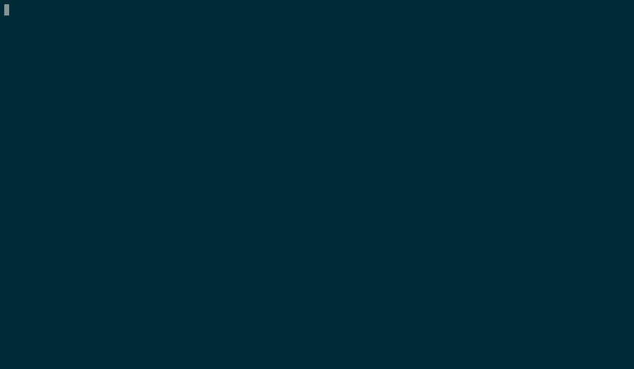

# Octopus Carnival

Octpus Carnival is an environment for playing the [Machiavelli card game](https://en.wikipedia.org/wiki/Machiavelli_(Italian_card_game)) inside the terminal.
It features a solver in order to play against the computer.



## Getting Started

### Prerequisites

The Machiavelli solver is written in Ocaml:

```
opam install corebuild dune yojson core
```

The TUI is written in python:

```
pip3 install --user colorama picotui
```

## The game

In order to play the game first build the solver:

```
cd octopus_carnival
make
```

Then run the executable

```
./ono_sendai/start
```
[](https://raw.githubusercontent.com/FraMecca/Octopus_Carnival/master/ono_sendai/animation/rec.mp4)


## Contributing

The folder structure follows a non standard layout for personal reasons.

```
.
├── hosaka
│   ├── cards.ml
│   ├── dune
│   ├── dune-project
│   ├── hashset.ml
│   ├── main.ml
│   ├── printer.ml
│   ├── table.ml
│   ├── tcards.ml
│   └── tests.ml
├── makefile
├── metro_holografix
│   ├── cardtypes.py
│   └── scrapes
│       ├── alg.py
│       ├── cardtypes.py
│       ├── test.py
│       └── vecchio.py
├── ono_sendai
│   ├── animation/
│   ├── start
│   ├── state.py
│   ├── symbols.py
│   └── widgets.py
```

* *hosaka* contains the code related to the solver
* *metro_holografix* contains the python definitions for the cards and some prototypes
* *ono_sendai* contains all the python code related to the game TUI


## Authors

* **Francesco Mecca** - [blog](https://francescomecca.eu)

## License

This project is licensed under the GPLv3 License - see the [LICENSE.md](LICENSE.md) file for details

## Acknowledgments

Thanks to my friend [Daniele](https://github.com/danseraf) that helped me to write the algorithm for the solver. 
